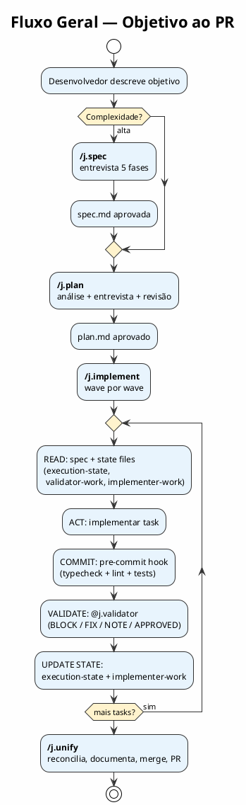
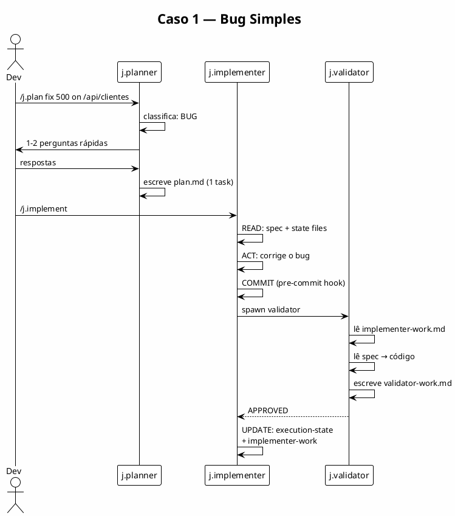
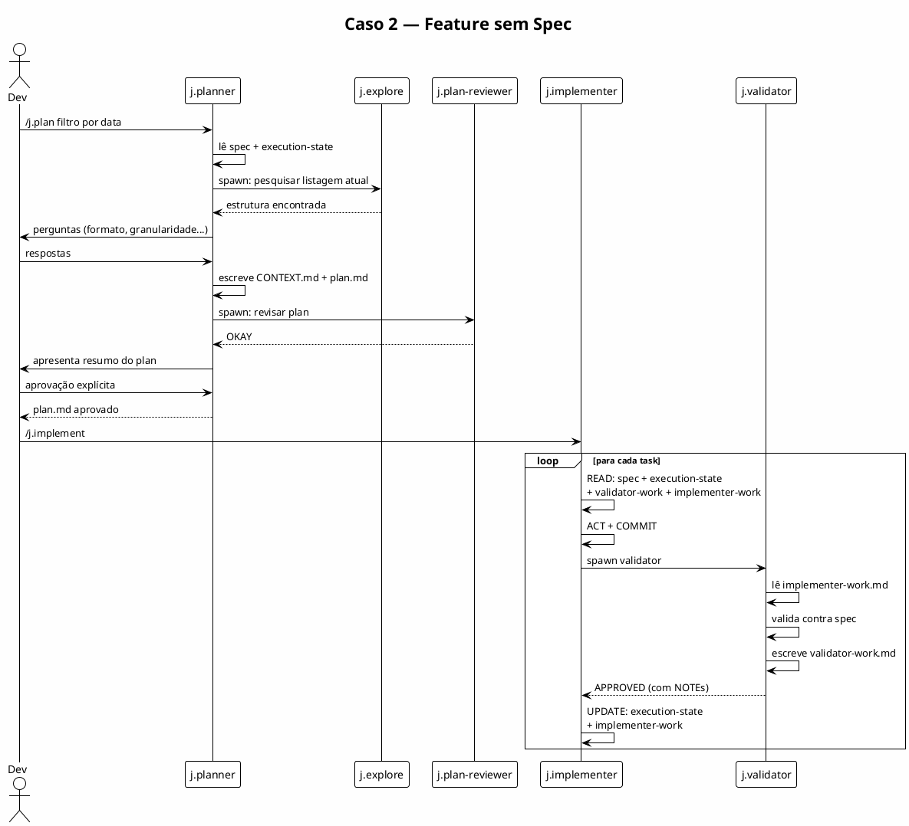
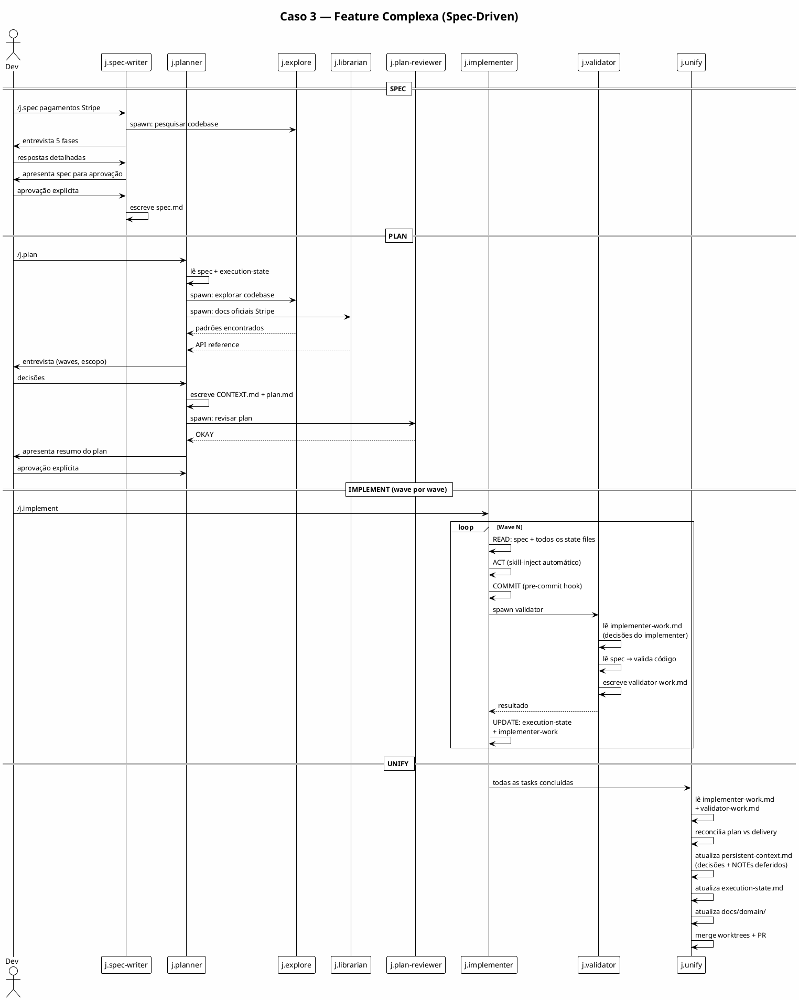
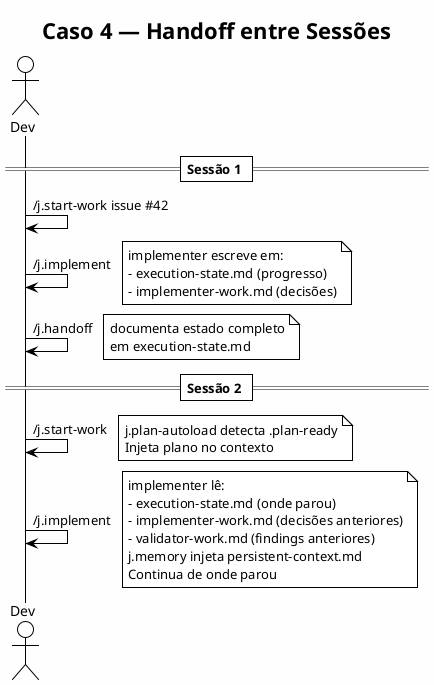

# Workflow Recomendado

Este guia mostra como usar o juninho framework no dia a dia — do objetivo ao PR.

---

## Fluxo padrão



---

## Caso 1 — Bug simples

```
Situação: "a rota /api/clientes retorna 500 quando o ID não existe"
```

```
# Direto para o implementer — sem planejamento necessário
@j.implementer fix the 500 error on /api/clientes when ID doesn't exist

# Ou com contexto mínimo via plan
/j.plan fix 500 error on GET /api/clientes/:id when record not found
```

O `@j.planner` vai classificar como `BUG`, fazer 1–2 perguntas, escrever um `plan.md` pequeno,
e o `@j.implementer` vai corrigir diretamente.



---

## Caso 2 — Feature nova (sem spec)

```
Situação: "adicionar filtro por data nos agendamentos"
```

```
/j.plan adicionar filtro por data na listagem de agendamentos
```

O `@j.planner` vai:
1. Ler a spec + `execution-state.md` (estado atual das tasks)
2. Explorar como a listagem atual funciona (via `@j.explore`)
3. Perguntar: formato de data, granularidade (dia/semana/mês), se afeta a query ou só o frontend
4. Escrever `plan.md` com 3–5 tasks

Depois:
```
/j.implement
```



---

## Caso 3 — Feature complexa (com spec)

```
Situação: "sistema completo de pagamentos com Stripe"
```

```
# Passo 1: spec detalhada primeiro
/j.spec sistema de pagamentos com Stripe

# @j.spec-writer vai conduzir entrevista de 5 fases:
# Discovery → Requirements → Contract → Data → Review
# Escreve docs/specs/sistema-pagamentos/spec.md

# Passo 2: plano baseado na spec
/j.plan

# @j.planner lê a spec + execution-state.md, planeja em waves

# Passo 3: implementar
/j.implement

# @j.implementer executa wave por wave, @j.validator verifica contra a spec
```



---

## Caso 4 — Sessão longa com handoff

```
# Início de sessão
/j.start-work issue #42 — sistema de notificações

# Trabalho...
/j.implement

# Fim de sessão — documentar estado antes de fechar
/j.handoff
```

O `/j.handoff` escreve em `execution-state.md`:
- O que foi feito
- O que está em andamento (com próximo passo exato)
- O que está bloqueado

Na próxima sessão:
```
/j.start-work
# O plugin j.plan-autoload injeta o plano automaticamente
# O plugin j.memory injeta persistent-context.md (memória do projeto)
# O implementer lê execution-state + implementer-work.md para retomar
```



---

## Caso 5 — Muitas tasks independentes (modo paralelo)

```
Situação: 10 features pequenas do backlog, independentes entre si
```

```
# Popula execution-state.md com todas as tasks
/j.plan implementar todas as features do backlog sprint 3

# Ativa modo de máximo paralelismo
/j.ulw-loop
```

O `/j.ulw-loop` vai:
1. Identificar tasks que não têm dependências entre si
2. Criar um worktree por task em `worktrees/`
3. Rodar `@j.implementer` em paralelo em cada worktree
4. Validar cada wave
5. `@j.unify` mergea tudo e cria o PR

```plantuml
@startuml
!theme plain
skinparam backgroundColor #FEFEFE

title Caso 5 — Modo Paralelo (ULW Loop)

actor Dev
participant "j.planner" as P
participant "worktree-1\nj.implementer" as I1
participant "worktree-2\nj.implementer" as I2
participant "worktree-3\nj.implementer" as I3
participant "j.validator" as V
participant "j.unify" as U

Dev -> P: /j.plan backlog sprint 3
P -> P: identifica 6 tasks em 2 waves
P --> Dev: plan.md aprovado

Dev -> Dev: /j.ulw-loop

== Wave 1 (tasks independentes) ==
par Paralelo
  I1 -> I1: READ → ACT → COMMIT
  I1 -> V: VALIDATE
  V --> I1: APPROVED
and
  I2 -> I2: READ → ACT → COMMIT
  I2 -> V: VALIDATE
  V --> I2: APPROVED
and
  I3 -> I3: READ → ACT → COMMIT
  I3 -> V: VALIDATE
  V --> I3: APPROVED
end

== Wave 2 (tasks dependentes de Wave 1) ==
note over I1,I3: Repete com tasks restantes

== UNIFY ==
U -> U: lê work files de todos os worktrees
U -> U: merge branches + atualiza docs
U -> U: gh pr create

@enduml
```

---

## Inicializando um projeto existente

Se o projeto já tem código e você quer que o CARL e os agentes entendam o domínio:

```
/j.init-deep
```

Isso escaneia o codebase e preenche:
- `docs/domain/INDEX.md` — mapa de entidades, serviços, rotas
- `docs/principles/manifest` — padrões canônicos encontrados
- `AGENTS.md` hierárquico por diretório

Deve ser feito uma vez após o `juninho setup`, e repetido após refactors grandes.

---

## Sistema de Estado — Como os agentes se comunicam

Os agentes usam 4 arquivos de estado em `.opencode/state/` para se comunicar entre si e entre sessões.

```plantuml
@startuml
!theme plain
skinparam backgroundColor #FEFEFE
skinparam componentBackgroundColor #E8F4FD
skinparam databaseBackgroundColor #FFF3CD
skinparam noteBackgroundColor #F5F5F5

title Fluxo de Dados — State Files

database "persistent-context.md" as PC {
  Decisões arquiteturais
  Padrões estabelecidos
  Lições aprendidas
}

database "execution-state.md" as ES {
  Task table (ID/status)
  Spec + plan paths
  Files modified
}

database "validator-work.md" as VW {
  BLOCK / FIX / NOTE
  Audit trail por ciclo
  NOTEs deferidos
}

database "implementer-work.md" as IW {
  Decisões tomadas
  Desvios do plano
  Blockers encontrados
}

component "j.planner" as P
component "j.implementer" as I
component "j.validator" as V
component "j.unify" as U
component "j.memory (plugin)" as M

M ..> PC : lê (injeta na sessão)

I ..> ES : lê/escreve (steps 1, 5)
I ..> VW : lê (step 1)
I ..> IW : escreve (step 5)

V ..> IW : lê (antes de validar)
V ..> VW : escreve (após validar)

U ..> IW : lê (step 1)
U ..> VW : lê (step 1)
U ..> PC : lê/escreve (step 3)
U ..> ES : lê/escreve (steps 1, 4)

@enduml
```

### Quem lê e escreve o quê

| State File | Planner | Implementer | Validator | UNIFY | j.memory (plugin) |
|---|---|---|---|---|---|
| `persistent-context.md` | — | — | — | **R/W** (step 3) | **R** (injeta na sessão) |
| `execution-state.md` | — | **R/W** (steps 1, 5) | — | **R/W** (steps 1, 4) | — |
| `validator-work.md` | — | **R** (step 1) | **W** (após validar) | **R** (step 1) | — |
| `implementer-work.md` | — | **W** (step 5) | **R** (antes de validar) | **R** (step 1) | — |

---

## Dicas de produtividade

### Use `persistent-context.md` para decisões arquiteturais

Quando você tomar uma decisão importante ("vamos usar Zustand em vez de Redux porque..."), registre em `.opencode/state/persistent-context.md`. O plugin `j.memory` injeta esse arquivo automaticamente:
- **Sessão:** injetado na primeira tool call via `tool.execute.after`
- **Compaction:** re-injetado via `experimental.session.compacting` para sobreviver resets
- **UNIFY** — único agente que escreve (reconcilia e atualiza)

### Skills são automáticas

Não precisa mencionar skills explicitamente. O plugin `j.skill-inject` detecta o tipo de arquivo e injeta as instruções certas. Escrever um teste? As regras de `test-writing` aparecem automaticamente.

### Deixe o `j.todo-enforcer` trabalhar

Não precisa lembrar o agente de continuar. Se `execution-state.md` tem tasks incompletas, o plugin re-injeta a lista quando a sessão fica idle. O agente vai voltar ao trabalho.

### Quando usar `@j.reviewer` vs `@j.validator`

- `@j.validator` — pergunta "a implementação atende a spec?" (blocking, objetivo)
- `@j.reviewer` — pergunta "a implementação tem boa qualidade?" (advisory, subjetivo)

Use os dois: primeiro `@j.validator` para corretude, depois `@j.reviewer` para qualidade.

### O validator conhece as decisões do implementer

O `@j.validator` lê `implementer-work.md` antes de validar. Se o implementer documentou uma decisão ("usei X ao invés de Y por causa de Z"), o validator avalia a justificativa em vez de bloquear cegamente.

---

## Troubleshooting

### "O agente não está lendo o plano"

Verifique se `.opencode/state/.plan-ready` existe:
```bash
cat .opencode/state/.plan-ready
# deve conter o path para plan.md
```

Se não existir, o `@planner` não concluiu ou o arquivo foi deletado. Rode `/j.plan` novamente.

### "O plugin j.skill-inject não está ativando"

Verifique se o path do arquivo segue o padrão. Ex: para `api-route-creation` ativar, o arquivo deve ser `app/api/alguma-coisa/route.ts` — o padrão `app/api/**/*.ts`.

Para ver os padrões: `cat .opencode/plugins/j.skill-inject.ts`

### "O hashline-edit rejeitou meu edit"

O agente tentou editar uma linha que mudou desde a última leitura. Solução:
1. O agente deve reler o arquivo com `Read`
2. Usar os novos hashlines nas referências
3. Tentar o edit novamente

Isso é um feature, não um bug — previne edits destrutivos em código stale.

### "O implementer está repetindo erros do ciclo anterior"

Verifique se `validator-work.md` existe e contém os findings do ciclo anterior. O implementer deve lê-lo no step 1 (READ). Se o arquivo está vazio ou ausente, o validator pode não estar escrevendo nele — verifique o prompt do validator.
